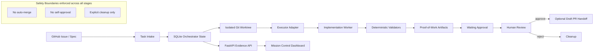

# Agent Taskflow

[English](README.md) | [繁體中文](README.zh-TW.md)

Agent Taskflow is a Python-native, GitHub-oriented orchestration system for
human-gated AI engineering workflows.

Its core principle is:

> Manage work, not agents.

AI coding tools such as Pi, OpenCode, Codex, Claude Code, or future executors are
treated as bounded implementation workers. Agent Taskflow manages the work around
them: task state, workspace isolation, executor invocation, validation,
proof-of-work collection, and human review handoff.

Agent Taskflow is **not** a chatbot, autonomous merge bot, or background coding
daemon. It is an orchestration layer for turning GitHub issues or specs into
reviewable engineering work under explicit human control.

---

## Portfolio Snapshot

| Area                   | What Agent Taskflow Demonstrates                                             |
| ---------------------- | ---------------------------------------------------------------------------- |
| AI engineering         | Bounded executor model for Pi, OpenCode, Codex, Claude Code, or future tools |
| Workflow orchestration | Issue/spec intake, task state, dispatcher lifecycle, handoff flow            |
| Software engineering   | Local SQLite state store, isolated worktrees, deterministic validators       |
| Safety design          | Human approval gates, no self-approval, no automatic merge                   |
| Evidence discipline    | Proof-of-work artifacts, validator results, logs, branch/PR handoff evidence |
| Observability          | Mission Control as read-only review and evidence dashboard                   |

---

## What Problem This Solves

AI coding tools can generate code, but they should not own the full software
delivery lifecycle.

Agent Taskflow separates implementation from orchestration:

1. A human-authored GitHub Issue or spec defines the work.
2. Agent Taskflow mirrors the task into local state.
3. The system prepares an isolated workspace.
4. A bounded executor performs implementation work.
5. Deterministic validators produce proof-of-work.
6. Evidence artifacts are collected for review.
7. A human decides whether to approve, publish, merge, or clean up.

The goal is not to replace the human reviewer.
The goal is to make AI-assisted software work traceable, reviewable, and governed.

---

## System Overview

```text
GitHub Issue / Spec
  → Local Task Intake
  → SQLite Orchestrator State
  → Isolated Git Worktree
  → Bounded Executor Adapter
  → Deterministic Validators
  → Proof-of-Work Artifacts
  → Waiting Approval
  → Human Review
  → Optional Branch Push / Draft PR Handoff
  → Explicit Cleanup
```

Agent Taskflow manages work lifecycle and evidence. Executors are replaceable
implementation workers. Validators are deterministic proof-of-work gates.
Mission Control is observability and review, not the execution core.

---

## Architecture Diagram



---

## Current Capabilities

* Human-authored GitHub Issue / spec intake
* Local SQLite task mirror and orchestrator state storage
* Explicit local-first ingestion flow
* Isolated git worktree preparation
* Bounded executor adapter model
* Executor preflight before real executor runs
* Deterministic validators:

  * pytest
  * optional openspec
  * policy checks
  * changed-files checks
  * smoke tests
* Proof-of-work artifact collection
* Executor logs and changed-file evidence
* Waiting-approval review summary generation
* Local PR handoff package generation
* Explicit branch publication preview
* Explicit draft PR creation preview
* Mission Control read-only review and evidence dashboard
* Human review as final approval gate

---

## Semi-Automatic Dogfood Loop

The current dogfood loop is operator-driven and semi-automatic:

1. A human discovers or selects a GitHub Issue or spec.
2. The operator explicitly ingests the selected issue into the local SQLite mirror.
3. The operator runs queued-task recommendation and explicitly selects the task key.
4. The operator runs approved task execution in an isolated worktree.
5. Deterministic validators record proof-of-work.
6. The task reaches `waiting_approval` only after validation passes.
7. The operator generates a waiting-approval review summary and local PR handoff package.
8. Branch push is explicit and requires confirmation.
9. Draft PR creation is explicit and requires confirmation.
10. Cleanup is explicit and separate from validation success.
11. A human reviews the evidence and decides what happens next.

The explicit branch push and draft PR creation commands are dry-run by default and
require confirmation flags before they mutate GitHub.

---

## Operator Flow

Run the local validation baseline before dogfood work:

```bash
source .venv/bin/activate
python3 scripts/run_local_validation.py
```

Ingest one GitHub Issue into the local mirror:

```bash
python3 scripts/ingest_github_issue.py \
  --repo owner/repo \
  --issue-number 123 \
  --db-path /absolute/path/to/state.db \
  --local-repo-path /absolute/path/to/repo \
  --artifact-root /absolute/path/to/artifacts \
  --task-key AT-123
```

Prepare an isolated worktree:

```bash
python3 scripts/prepare_task_workspace.py \
  --task-key AT-123 \
  --db-path /absolute/path/to/state.db \
  --base-branch main
```

Run executor preflight before a real executor path:

```bash
python3 scripts/run_real_executor_preflight.py \
  --executor opencode \
  --validators pytest,openspec
```

Dispatch the task explicitly:

```bash
python3 scripts/run_dispatcher.py \
  --task-key AT-123 \
  --db-path /absolute/path/to/state.db \
  --executor opencode \
  --validators pytest,openspec
```

Generate local PR handoff evidence after the task reaches `waiting_approval`:

```bash
python3 scripts/create_pr_handoff.py \
  --task-key AT-123 \
  --db-path /absolute/path/to/state.db \
  --repo owner/repo
```

Preview branch publication:

```bash
python3 scripts/push_task_branch.py \
  --task-key AT-123 \
  --db-path /absolute/path/to/state.db \
  --dry-run
```

Preview draft PR creation:

```bash
python3 scripts/create_draft_pr.py \
  --task-key AT-123 \
  --db-path /absolute/path/to/state.db \
  --dry-run
```

---

## Evidence of Engineering Quality

Agent Taskflow is structured around reviewable evidence rather than hidden
automation.

The system records or surfaces:

* task state transitions
* executor metadata
* validator results
* changed-file evidence
* issue/spec artifacts
* executor logs
* handoff metadata
* branch publication evidence
* draft PR evidence
* dogfood evidence readback in Mission Control

Recommended validation entrypoint:

```bash
python3 scripts/run_local_validation.py
```

---

## Safety Boundaries

Agent Taskflow intentionally does **not** claim to provide:

* automatic merge
* automatic approval
* worker self-approval
* automatic cleanup
* hidden background GitHub sync
* webhook-driven autonomous execution
* brokered remote worker pools
* unrestricted AI agent autonomy

Current safety boundaries:

* Executors are bounded implementation workers.
* Validators are deterministic proof-of-work gates.
* SQLite is orchestrator state storage.
* FastAPI exposes state and evidence for review.
* Mission Control is observability and review, not the execution core.
* Approval metadata is a human review gate.
* Workers cannot self-approve, push, merge, or clean up.
* Validation success does not imply automatic publication, merge, or cleanup.

---

## Deferred Automation

The following capabilities are intentionally deferred:

* Queue or polling automation for selecting and starting new tasks.
* Webhook or background GitHub issue sync.
* Dispatcher-driven workspace creation.
* Dispatcher-driven branch push or PR creation.
* Automatic merge after approval.
* Automatic cleanup, branch deletion, or worktree deletion.
* Remote worker pools and multi-host scheduling.

These are governance and lifecycle decisions, not executor behavior.

---

## Portfolio Context

Agent Taskflow is the AI engineering workflow orchestration project in my
portfolio.

```text
agent-taskflow
  → demonstrates human-gated automation, validation, and proof-of-work workflows

AlphaForge
  → demonstrates ML-oriented quantitative research validation and artifact reporting

SignalForge
  → demonstrates standardized signal-generation artifacts for AlphaForge

bs_pricer
  → demonstrates financial engineering model implementation
```

Together, these projects show a broader direction:

> building reproducible research and engineering systems with explicit boundaries,
> deterministic validation, human review gates, and reviewable evidence.

---

## Historical Note

Older Hermes/Kanban extraction scripts and docs may still exist as historical
context, but they are not the current primary architecture. The current system is
the local SQLite, explicit worktree, bounded executor, deterministic validator,
proof-of-work, PR handoff, and human review loop described above.
