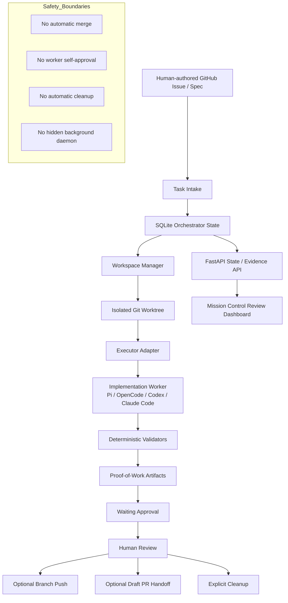

# Agent Taskflow

[English](README.md) | 繁體中文

Agent Taskflow 是一個 Python-native、GitHub-oriented 的 workflow orchestration system，用於管理 human-gated AI engineering workflows。

它的核心原則是：

> Manage work, not agents.

Pi、OpenCode、Codex、Claude Code 或未來其他 AI coding tools，在這個系統中都被視為 bounded implementation workers。Agent Taskflow 管理的是圍繞這些 worker 的工作流程：task state、workspace isolation、executor invocation、validation、proof-of-work collection，以及 human review handoff。

Agent Taskflow **不是** chatbot、不是 autonomous merge bot，也不是背景自動寫程式 daemon。
它是一個 orchestration layer，目標是把 GitHub issues 或 specs 轉換成可追蹤、可驗證、可審查，並且受人類明確控制的工程工作流。

---

## 作品集定位

| 面向 | Agent Taskflow 展示的能力 |
|---|---|
| AI engineering | 將 Pi、OpenCode、Codex、Claude Code 或未來工具抽象成 bounded executor |
| Workflow orchestration | Issue/spec intake、task state、dispatcher lifecycle、handoff flow |
| 軟體工程 | Local SQLite state store、isolated worktrees、deterministic validators |
| 安全設計 | Human approval gates、no self-approval、no automatic merge |
| Evidence discipline | Proof-of-work artifacts、validator results、logs、branch/PR handoff evidence |
| Observability | Mission Control 作為 read-only review / evidence dashboard |

---

## 這個專案解決什麼問題？

AI coding tools 可以產生程式碼，但它們不應該擁有完整的 software delivery lifecycle。

Agent Taskflow 把「實作」和「流程治理」分開：

1. Human-authored GitHub Issue 或 spec 定義任務。
2. Agent Taskflow 將 task mirror 到 local state。
3. 系統準備 isolated workspace。
4. Bounded executor 執行 implementation work。
5. Deterministic validators 產生 proof-of-work。
6. 系統收集 evidence artifacts 供人類審查。
7. Human reviewer 決定是否 approve、publish、merge 或 cleanup。

這個專案的目標不是取代人類 reviewer。
它的目標是讓 AI-assisted software work 變得 traceable、reviewable、governed。

---

## 系統流程

```text
GitHub Issue / Spec
  → Local Task Intake
  → SQLite Orchestrator State
  → Isolated Git Worktree
  → Bounded Executor Adapter
  → Deterministic Validators
  → Proof-of-Work Artifacts
  → Waiting Approval
  → Human Review
  → Optional Branch Push / Draft PR Handoff
  → Explicit Cleanup
```

Agent Taskflow 管理的是 work lifecycle 與 evidence。
Executors 是可替換的 implementation workers。
Validators 是 deterministic proof-of-work gates。
Mission Control 是 observability / review dashboard，不是 execution core。

---

## 架構圖



---

## 目前能力

- Human-authored GitHub Issue / spec intake
- Local SQLite task mirror and orchestrator state storage
- Explicit local-first ingestion flow
- Isolated git worktree preparation
- Bounded executor adapter model
- Executor preflight before real executor runs
- Deterministic validators:
  - pytest
  - optional openspec
  - policy checks
  - changed-files checks
  - smoke tests
- Proof-of-work artifact collection
- Executor logs and changed-file evidence
- Waiting-approval review summary generation
- Local PR handoff package generation
- Explicit branch publication preview
- Explicit draft PR creation preview
- Mission Control read-only review and evidence dashboard
- Human review as final approval gate

---

## Semi-Automatic Dogfood Loop

目前的 dogfood loop 是 operator-driven、semi-automatic：

1. 人類選擇 GitHub Issue 或 spec。
2. Operator 明確地將 selected issue ingest 到 local SQLite mirror。
3. Operator 執行 queued-task recommendation，並明確選擇 task key。
4. Operator 在 isolated worktree 中執行 approved task execution。
5. Deterministic validators 記錄 proof-of-work。
6. 驗證通過後，task 才會進入 `waiting_approval`。
7. Operator 產生 waiting-approval review summary 與 local PR handoff package。
8. Branch push 是 explicit，並且需要 confirmation。
9. Draft PR creation 是 explicit，並且需要 confirmation。
10. Cleanup 是 explicit，且與 validation success 分離。
11. Human reviewer 檢查 evidence，並決定下一步。

Branch push 與 draft PR creation 指令預設是 dry-run。
只有在 operator 明確提供 confirmation flags 後，才會對 GitHub 造成 mutation。

---

## Operator Flow

執行 local validation baseline：

```bash
source .venv/bin/activate
python3 scripts/run_local_validation.py
```

Ingest 一個 GitHub Issue 到 local mirror：

```bash
python3 scripts/ingest_github_issue.py \
  --repo owner/repo \
  --issue-number 123 \
  --db-path /absolute/path/to/state.db \
  --local-repo-path /absolute/path/to/repo \
  --artifact-root /absolute/path/to/artifacts \
  --task-key AT-123
```

準備 isolated worktree：

```bash
python3 scripts/prepare_task_workspace.py \
  --task-key AT-123 \
  --db-path /absolute/path/to/state.db \
  --base-branch main
```

在 real executor path 前執行 executor preflight：

```bash
python3 scripts/run_real_executor_preflight.py \
  --executor opencode \
  --validators pytest,openspec
```

明確 dispatch task：

```bash
python3 scripts/run_dispatcher.py \
  --task-key AT-123 \
  --db-path /absolute/path/to/state.db \
  --executor opencode \
  --validators pytest,openspec
```

當 task 進入 `waiting_approval` 後產生 local PR handoff evidence：

```bash
python3 scripts/create_pr_handoff.py \
  --task-key AT-123 \
  --db-path /absolute/path/to/state.db \
  --repo owner/repo
```

Preview branch publication：

```bash
python3 scripts/push_task_branch.py \
  --task-key AT-123 \
  --db-path /absolute/path/to/state.db \
  --dry-run
```

Preview draft PR creation：

```bash
python3 scripts/create_draft_pr.py \
  --task-key AT-123 \
  --db-path /absolute/path/to/state.db \
  --dry-run
```

---

## 工程品質證據

Agent Taskflow 的設計重點是 reviewable evidence，而不是 hidden automation。

系統會記錄或呈現：

- task state transitions
- executor metadata
- validator results
- changed-file evidence
- issue/spec artifacts
- executor logs
- handoff metadata
- branch publication evidence
- draft PR evidence
- Mission Control 中的 dogfood evidence readback

建議驗證入口：

```bash
python3 scripts/run_local_validation.py
```

---

## 安全邊界

Agent Taskflow 不聲稱提供：

- automatic merge
- automatic approval
- worker self-approval
- automatic cleanup
- hidden background GitHub sync
- webhook-driven autonomous execution
- brokered remote worker pools
- unrestricted AI agent autonomy

目前安全邊界：

- Executors 是 bounded implementation workers。
- Validators 是 deterministic proof-of-work gates。
- SQLite 是 orchestrator state storage。
- FastAPI exposes state and evidence for review。
- Mission Control 是 observability and review，不是 execution core。
- Approval metadata 是 human review gate。
- Workers 不能 self-approve、push、merge 或 cleanup。
- Validation success 不代表 automatic publication、merge 或 cleanup。

---

## Deferred Automation

以下能力是刻意延後的：

- Queue or polling automation for selecting and starting new tasks.
- Webhook or background GitHub issue sync.
- Dispatcher-driven workspace creation.
- Dispatcher-driven branch push or PR creation.
- Automatic merge after approval.
- Automatic cleanup, branch deletion, or worktree deletion.
- Remote worker pools and multi-host scheduling.

這些是 governance and lifecycle decisions，不是 executor behavior。

---

## 與其他作品的關係

Agent Taskflow 是我作品集中展示 AI engineering workflow orchestration 的專案。

```text
agent-taskflow
  → 展示 human-gated automation、validation、proof-of-work workflow

AlphaForge
  → 展示 ML-oriented quantitative research validation 與 artifact reporting

SignalForge
  → 展示標準化 signal-generation artifacts，供 AlphaForge 使用

bs_pricer
  → 展示 financial engineering model implementation
```

這四個作品共同呈現的方向是：

> 建立具備明確邊界、deterministic validation、human review gates 與 reviewable evidence 的可重現研究與工程系統。

---

## Historical Note

較早期的 Hermes / Kanban extraction scripts 與 docs 可能仍作為歷史脈絡存在，但它們不是目前主要架構。

目前主要架構是：

```text
local SQLite
  → explicit worktree
  → bounded executor
  → deterministic validator
  → proof-of-work
  → PR handoff
  → human review loop
```
